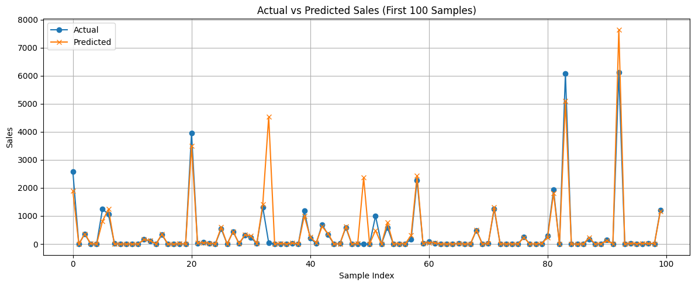
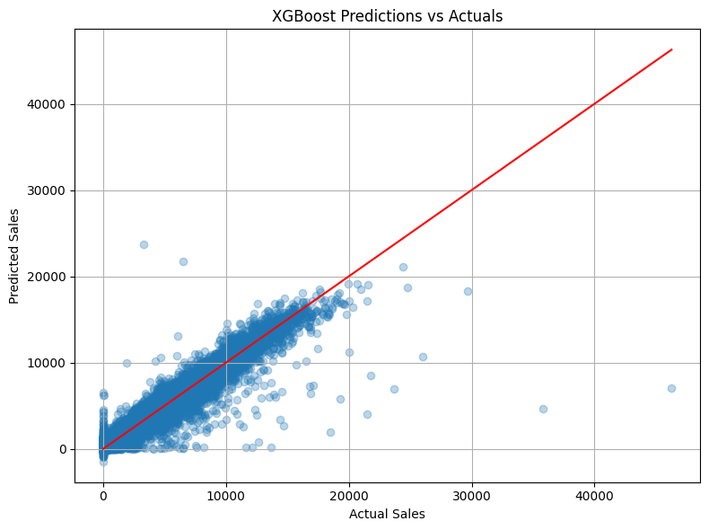
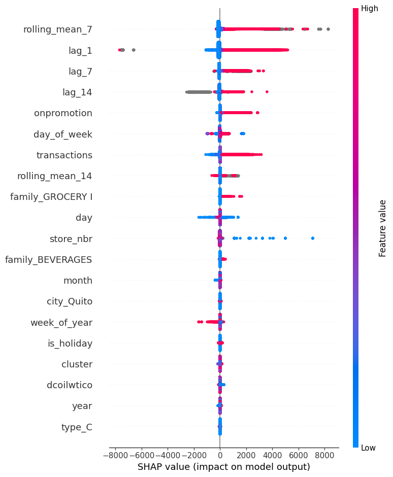
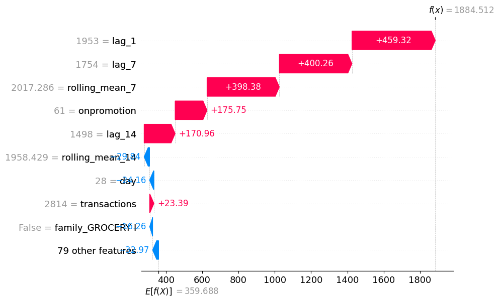
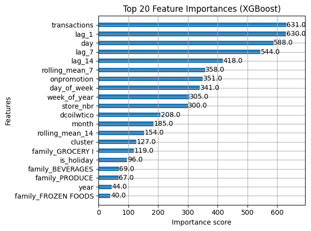

# 🛒 Favorita Grocery Sales Forecasting

End-to-end time series forecasting project using XGBoost, SHAP, and real-world grocery data.  
I don’t just tune models — I explain *why* they behave the way they do.

---

## 🚀 Overview

This project predicts daily item-level sales for a major grocery chain using structured time series data.  
It incorporates calendar events, oil prices, holidays, store metadata, and engineered time features.

> ⚠️ **Note:** Raw datasets (`train.csv`, `train_cleaned.csv`, etc.) have been excluded from this repository due to size constraints.  
> You can download the full dataset directly from the [Kaggle competition page](https://www.kaggle.com/competitions/store-sales-time-series-forecasting/data).


- 📆 Data: Favorita (Ecuador), 2013–2017
- 🤖 Model: XGBoost Regressor (tuned with GridSearchCV)
- 🧠 Explainability: SHAP (summary + local waterfall)
- 📈 Metrics: RMSE on holdout set

---

## 📦 Dataset Access

The data used in this project was obtained from the [Corporación Favorita Grocery Sales Forecasting competition on Kaggle](https://www.kaggle.com/competitions/store-sales-time-series-forecasting/data).

This repository excludes raw `.csv` files to meet GitHub's file size policy.

---

## 🧠 Project Highlights

| Step | Highlights |
|------|------------|
| 📊 EDA | Missing value handling, trend visualization |
| 🔨 Feature Engineering | Lag variables, rolling means, promo flags, holiday joins |
| 🧪 Model Tuning | GridSearchCV (light version on 10k rows) |
| 📉 Evaluation | RMSE, prediction plot, scatter vs actual |
| 🔍 Explainability | SHAP summary + waterfall plots |
| 💾 Output | Saved `.pkl` model, visualizations |

---

## 📈 Model Performance

| Metric       | Score    |
|--------------|----------|
| RMSE (val)   | 478.85   |

### 📊 Actual vs Predicted Plot


### 📊 Predicted vs Actual Scatter


---

## 🔍 Feature Importance

### 📌 SHAP Summary Plot
Shows which features most influenced the model.



### 🧠 SHAP Local Waterfall
Detailed explanation for a single prediction.



### 🔢 XGBoost Top 20 Features
Built-in feature importances based on split frequency.



---

## 📂 Project Structure

```
favorita_sales_forecasting/
│
├── data/
│   ├── train.csv
│   ├── test.csv
│   ├── stores.csv
│   ├── oil.csv
│   ├── holidays_events.csv
│   ├── transactions.csv
│   └── sample_submission.csv
│
├── images/
│   ├── shap_summary.png
│   ├── shap_waterfall.png
│   ├── actual_vs_predicted.png
│   ├── predicted_vs_actual.png
│   └── xgb_feature_importance.png
│
├── notebooks/
│   └── 01_EDA.ipynb
├── models/
│   └── xgb_favorita_model.pkl
├── requirements.txt
└── README.md
```

---

## 💡 Key Tools Used


---

## 📌 Future Improvements

- Add LSTM/Prophet comparison
- Use Optuna for deeper hyperparameter search
- Build Streamlit forecast explorer

---

## 📬 Author

**Nsikan**  
📧 [Email me](mailto:nsikanumoh56@gmail.com)  
🌐 Portfolio: [nsikan-portfolio.framer.website](https://nsikan-portfolio.framer.website)

---